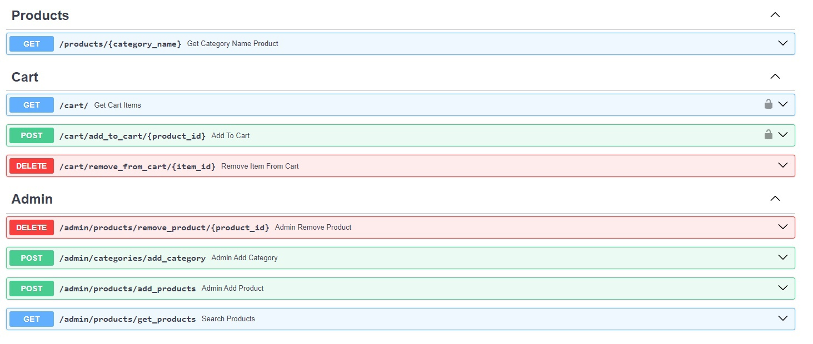
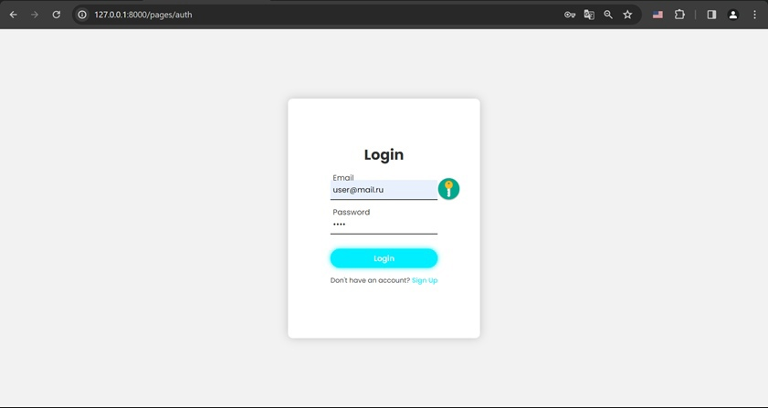
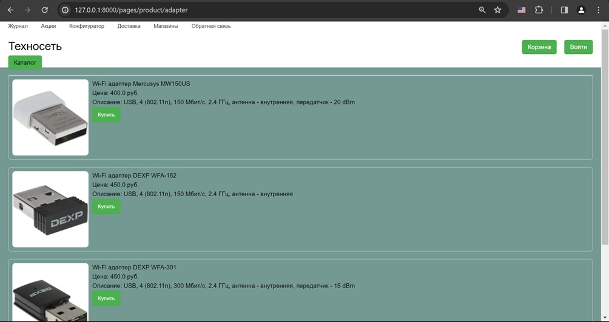
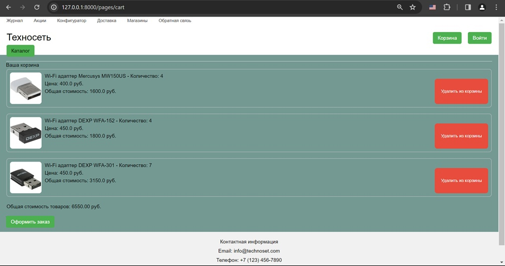
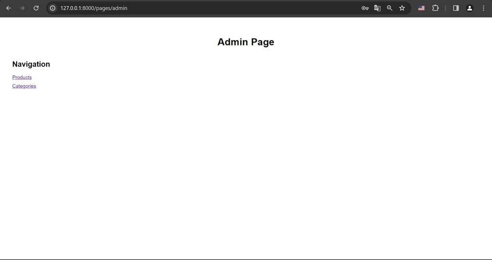
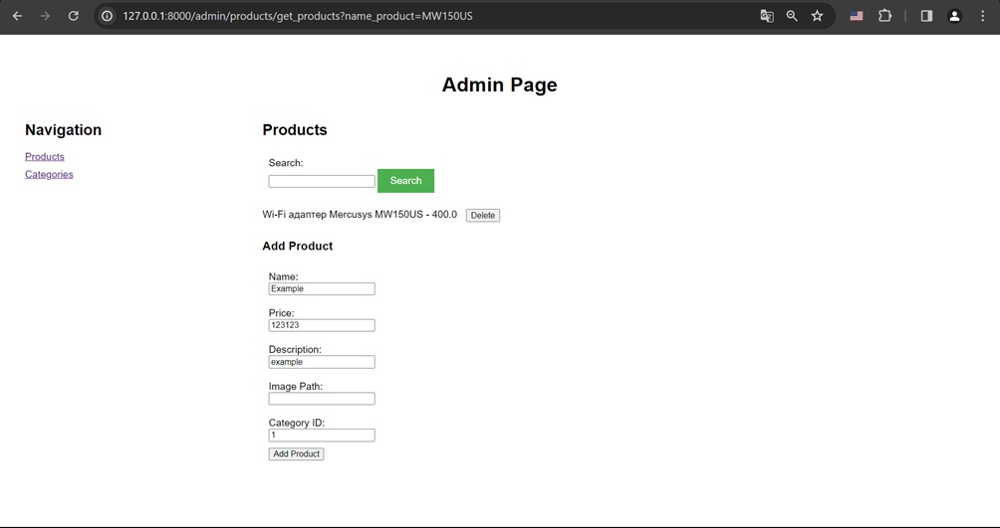
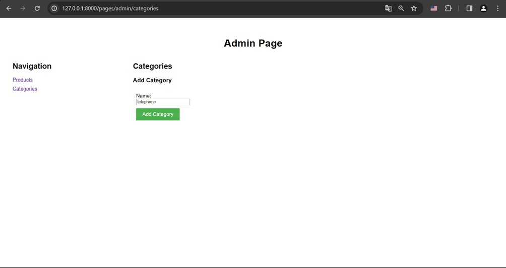

# Online-shop

## Стек:

- Python
- FastApi
- JS
- PostgreSQL
- Redis

## Что умеет Api

*OpenApi/Swagger*

### Клиент
- Может просматривать товары каждой категории
- Имеет возможность взаимодействия с корзиной(добавление/удаление товаров)
- Может создать свой аккаунт

*Регистрация и аутентификация*

*Вывод списка товаров категории "WI-FI адаптеры""*

*Просмотр корзины пользователя*

### Администратор
- Добавляет товары, категории товаров
- Удаляет товары

*Страница администратора*

*Страница управления товарами*

*Страница управления категориями*

